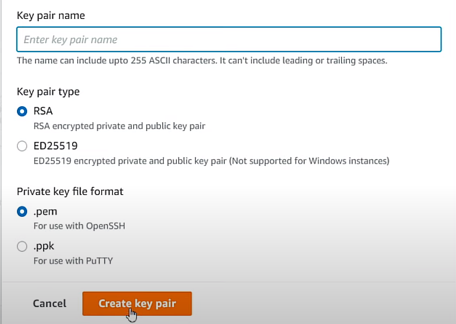

# Environment preparation aws

## Create EC2 Instance

* Go to EC2
* Create Instance
    
    * Ubuntu (22.04 LTS | 64-bit (x86))
    * t2.xlarge (free tier eligible)
    * select key(see below for creating a new key pair)
    * 30GB storage
    *

* Create a key (create new key pair)
    
    
## Connect to the Instance via ssh
    
```console 
    ssh -i ~/.ssh/<key_pair>.pem <machine>@<Public IPv4 address>
```

* `.ssh/config`

```bash
Host mlops-zoomcamp
    HostName <Public IPv4 address> or <Public IPv4 DNS>
    User <user-name>
    IdentityFile <complete path to the .pem>
    StrictHostKeyChecking no
```


## Config EC2

* Download Anaconda

* Install docker and docker compose

```bash
    sudo apt update
```

```bash
    sudo apt install docker.io
```
* Docker compose installation has more steps 
      
1) Download  from Githubdocker compose 

```bash
    wget https://github.com/docker/compose/releases/download/v2.5.0/docker-compose-linux-x86-64 -O docker-compose
```

2) Make file executable

```bash
    chmod +x docker-compose
```
it turns green


3) Add docker-compose to the path

```bash
    export PATH="${HOME}/<folder>:${PATH}"  (Alexey uses "/soft")
```

```bash
    nano .bash
    nano .bashrc
    source .bash
```
4) Add Docker to use group

```bash
    sudo groupadd docker
    sudo usermod -aG docker $USER
```

```bash
    which docker-compose
    docker run hellow-world
```